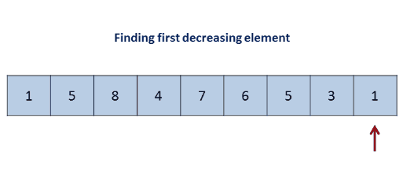

# [31. Next Permutation](https://leetcode.com/problems/next-permutation/)

Implement **next permutation**, which rearranges numbers into the lexicographically next greater permutation of numbers.

If such arrangement is not possible, it must rearrange it as the lowest possible order (ie, sorted in ascending order).

The replacement must be **in-place** and use only constant extra memory.

Here are some examples. Inputs are in the left-hand column and its corresponding outputs are in the right-hand column.

```
`1,2,3` → `1,3,2`
`3,2,1` → `1,2,3`
`1,1,5` → `1,5,1`
```

-----

**题目**：下一个全排列。

**思路**：下一个全排列，即在所有的排列中，刚好比当前排列所表征的值大，那么我们会从个位往前比较，即由后往前。例如数`1 2 3 4`，那么我们交换最后两个值即可；例如数`4 7 6 5 3 1`，我们发现后五个数`7 6 5 3 1`已经不能更大了，所以我们要找的是由后往前第一次遇到降序的那个数，即`4`，将`4`和`7 6 5 3 1`中某个数替换并使得其仍然有序，那是替换`5`还是`3`呢？因为是下一个全排列，所以替换的是5，即`5 7 6 4 3 1`，最后再将后5位逆序排列，即得到`5 1 3 4 6 7`。



[**工程代码下载**](https://github.com/shenkh/leetcode)

```cpp
class Solution {
public:
    void nextPermutation(vector<int>& nums) {
        int n = nums.size();
        int i = n-2;
        while(i >=0 && nums[i] >= nums[i+1])
            --i;
        if(i < 0)
            reverse(nums.begin(), nums.end());
        else{
            int j = i + 1;
            while(j < n && nums[j] > nums[i])
                ++j;
            swap(nums[i], nums[j-1]);
            reverse(nums.begin() + i + 1, nums.end());
        }
        return;
    }
};
```

上一个全排列：

```cpp
void prev_permutation(vector<int>& nums) {
    int n = nums.size();
    if (n == 0) return;

    int i = n - 2;
    while (i >= 0 && nums[i] < nums[i + 1])
        --i;
    if (i < 0)
        reverse(nums.begin(), nums.end());
    else {
        int j = i + 1;
        while (j < n && nums[i] > nums[j])
            ++j;
        swap(nums[i], nums[j-1]);
        reverse(nums.begin() + i + 1, nums.end());
    }
    return;
}
```

