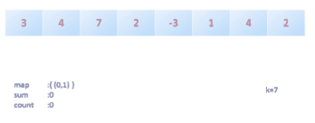

# [560. Subarray Sum Equals K](https://leetcode.com/problems/subarray-sum-equals-k/)

Given an array of integers and an integer **k**, you need to find the total number of continuous subarrays whose sum equals to **k**.

**Example 1:**

```
Input:nums = [1,1,1], k = 2
Output: 2
```

**Note:**

1. The length of the array is in range [1, 20,000].
2. The range of numbers in the array is [-1000, 1000] and the range of the integer **k** is [-1e7, 1e7].

------

**题目**：给定一个数组，计算和为K的子数组的个数(子数组要求是连续的)。

**思路1**：首先第一想法就是暴力循环。第一层循环变量是子串在数组中的起始位置，第二层循环变量是子串的长度，然后将子串的和和目标值K相比较。

[**工程代码下载**](https://github.com/shenkh/leetcode)

```cpp
#include <iostream>
#include<vector>
#include<unordered_map>
using namespace std;


//Using Cummulative sum
class Solution1 {
public:
    int subarraySum(vector<int>& nums, int k) {
        if (nums.size() == 0)
            return 0;

        int res = 0;
        vector<int> sum(nums.size() + 1);
        sum[0] = 0;
        for (int i = 0; i < nums.size(); i++)
            sum[i + 1] = sum[i] + nums[i];

        for (int i = 0; i < nums.size(); i++)
            for (int j = i + 1; j <= nums.size(); j++)
                if (sum[j] - sum[i] == k)
                    res++;

        return res;
    }
};


int main()
{
    Solution1 sln;
    vector<int> testcase{ 1,1,1 };
    cout << sln.subarraySum(testcase, 2) << endl;
    std::cout << "Hello World!\n";
}
```

**思路2**：另一种方式是通过`map`来记录前`n`个元素中已经出现过的和（和的计算均从最左侧的元素开始），以及对应的次数。用`cur_sum`来表示前`j`个元素的和，前`j-1`个元素出现过的和的哈希表集合记为`sum_counts`，那么如果我们要确定前`j`个元素中是否有子串的和为目标值`K`，

只需要判断哈希表`sum_counts`中是否有`cur_sum-K`这个键值，

怎么理解呢，因为`sum_counts`中存放的是`sum(0,i)`，即元素`0`到元素`i`的总和，而`cur_sum`的值等于`sum(0,j)`，如果子串（i到j）的和为`K`，我们可以得到`sum(0,i) + K = cur_sum`，变换一下表达式可以得到`sum(0,i) = cur_sum-K`，如果`sum(0,i)`的值在`sum_counts`中存在，那么从第`i`个位置开始到`j`的元素和就为目标值`K`了。



```cpp
class Solution {
public:
    int subarraySum(vector<int>& nums, int k) {
        // key：表示前n个元素的和sum；value：表示这个和出现过的次数
        unordered_map<int, int> mp;
        int cur = 0;  // cur表示的是前n个元素的和
        int res = 0;
        mp[0] = 1;  // 注意:和为0的次数要初始化为1次
        for(auto num : nums){
            cur += num;
            int target = cur - k;
            auto iter = mp.find(target);
            if(iter != mp.end()){
                res += iter->second;
            }
            mp[cur]++;
        }
        return res;
    }
};
```
