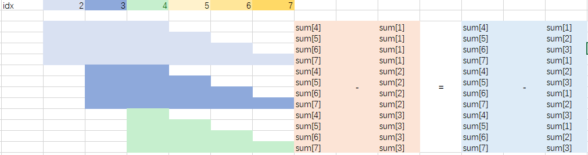

# [2281. Sum of Total Strength of Wizards](https://leetcode.com/problems/sum-of-total-strength-of-wizards/)

As the ruler of a kingdom, you have an army of wizards at your command.

You are given a **0-indexed** integer array `strength`, where `strength[i]` denotes the strength of the `ith` wizard. For a **contiguous** group of wizards (i.e. the wizards' strengths form a **subarray** of `strength`), the **total strength** is defined as the **product** of the following two values:

- The strength of the **weakest** wizard in the group.
- The **total** of all the individual strengths of the wizards in the group.

Return *the **sum** of the total strengths of **all** contiguous groups of wizards*. Since the answer may be very large, return it **modulo** `109 + 7`.

A **subarray** is a contiguous **non-empty** sequence of elements within an array.

**Example 1:**

```
Input: strength = [1,3,1,2]
Output: 44
Explanation: The following are all the contiguous groups of wizards:
- [1] from [1,3,1,2] has a total strength of min([1]) * sum([1]) = 1 * 1 = 1
- [3] from [1,3,1,2] has a total strength of min([3]) * sum([3]) = 3 * 3 = 9
- [1] from [1,3,1,2] has a total strength of min([1]) * sum([1]) = 1 * 1 = 1
- [2] from [1,3,1,2] has a total strength of min([2]) * sum([2]) = 2 * 2 = 4
- [1,3] from [1,3,1,2] has a total strength of min([1,3]) * sum([1,3]) = 1 * 4 = 4
- [3,1] from [1,3,1,2] has a total strength of min([3,1]) * sum([3,1]) = 1 * 4 = 4
- [1,2] from [1,3,1,2] has a total strength of min([1,2]) * sum([1,2]) = 1 * 3 = 3
- [1,3,1] from [1,3,1,2] has a total strength of min([1,3,1]) * sum([1,3,1]) = 1 * 5 = 5
- [3,1,2] from [1,3,1,2] has a total strength of min([3,1,2]) * sum([3,1,2]) = 1 * 6 = 6
- [1,3,1,2] from [1,3,1,2] has a total strength of min([1,3,1,2]) * sum([1,3,1,2]) = 1 * 7 = 7
The sum of all the total strengths is 1 + 9 + 1 + 4 + 4 + 4 + 3 + 5 + 6 + 7 = 44.
```

**Example 2:**

```
Input: strength = [5,4,6]
Output: 213
Explanation: The following are all the contiguous groups of wizards:
- [5] from [5,4,6] has a total strength of min([5]) * sum([5]) = 5 * 5 = 25
- [4] from [5,4,6] has a total strength of min([4]) * sum([4]) = 4 * 4 = 16
- [6] from [5,4,6] has a total strength of min([6]) * sum([6]) = 6 * 6 = 36
- [5,4] from [5,4,6] has a total strength of min([5,4]) * sum([5,4]) = 4 * 9 = 36
- [4,6] from [5,4,6] has a total strength of min([4,6]) * sum([4,6]) = 4 * 10 = 40
- [5,4,6] from [5,4,6] has a total strength of min([5,4,6]) * sum([5,4,6]) = 4 * 15 = 60
The sum of all the total strengths is 25 + 16 + 36 + 36 + 40 + 60 = 213.
```

**Constraints:**

- `1 <= strength.length <= 10^5`
- `1 <= strength[i] <= 10^9`

-----

**题目**：作为国王的统治者，你有一支巫师军队听你指挥。给你一个下标从 **0** 开始的整数数组 `strength` ，其中 `strength[i]` 表示第 `i` 位巫师的力量值。对于连续的一组巫师（也就是这些巫师的力量值是 `strength` 的 **子数组**），**总力量** 定义为以下两个值的 **乘积** ：巫师中 **最弱** 的能力值。组中所有巫师的个人力量值 **之和** 。请你返回 **所有** 巫师组的 **总** 力量之和。由于答案可能很大，请将答案对 `109 + 7` **取余** 后返回。**子数组** 是一个数组里 **非空** 连续子序列。

**思路**：单调栈，前缀和。参考[votrubac](https://leetcode.com/problems/sum-of-total-strength-of-wizards/discuss/2061787/Amazon-Online-Assessment)、[lee215](https://leetcode.com/problems/sum-of-total-strength-of-wizards/discuss/2061985/Python-Solution-O(n))。与[907. Sum of Subarray Minimums](https://leetcode.com/problems/sum-of-subarray-minimums/discuss/178876/stack-solution-with-very-detailed-explanation-step-by-step)相似。大数建议用python，C++数据溢出问题不好处理。计算前缀和的前缀和，如下假设以idx=4作为pivot。



[**工程代码下载**](https://github.com/shenkh/leetcode)

```cpp
class Solution {
public:
    int totalStrength(vector<int>& nums) {
        const int mod = 1e9 + 7;
        const int n = nums.size();

        // next small in the right
        vector<int> right(n, n);
        stack<int> sk;
        for(int i = 0; i < n; ++i){
            while(!sk.empty() && nums[sk.top()] > nums[i]){
                right[sk.top()] = i;
                sk.pop();
            }
            sk.push(i);
        }

        // next small on the left
        vector<int> left(n, -1);
        while(!sk.empty())
            sk.pop();
        for(int i = n-1; i >= 0; --i){
            while(!sk.empty() && nums[sk.top()] >= nums[i]){
                left[sk.top()] = i;
                sk.pop();
            }
            sk.push(i);
        }

        // presum of presum
        vector<long long> presum(n, 0);
        for(int i = 0; i < n; ++i){
            presum[i] = nums[i] + (i > 0 ? presum[i-1] : 0LL);
        }
        vector<long long> r2(n+1, 0);
        for(int i = 0; i < n; ++i){
            r2[i+1] = (presum[i] + r2[i]) % mod;
        }

        // for each A[i] as minimum, calculate sum
        long long res = 0;
        for(int i = 0; i < n; ++i){
            int l = left[i], r = right[i];
            long long lacc = r2[i] - r2[max(l, 0)];
            long long racc = r2[r] - r2[i];
            int nl = i - l, nr = r - i;
            // 需要加个 + mod
            res = (res + (racc * nl % mod - lacc * nr % mod) * nums[i] + mod) % mod;
        }
        return res;
    }
};
```
